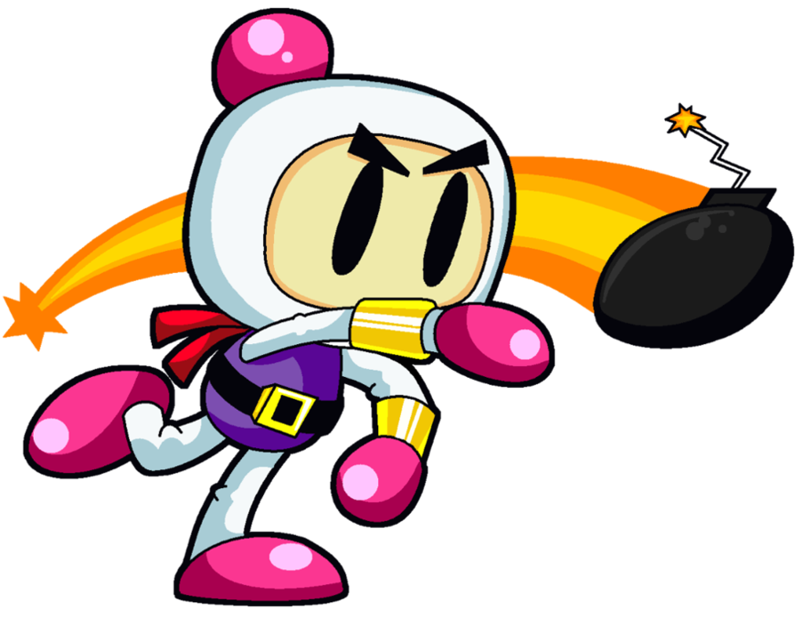

A game similar to Dyna Blaster (Bomberman)

# Description
Bombero is a 2D game similar to Dyna Blaster (Bomberman). 
Goal of the game is eliminating all enemies and escaping through hidden gate. This is achieved by using bombs. Player has limited amount of time to do that.

## Menu
After game starts, player can see a menu with following options:
### New game
Starts a new game with level #1. 
Player has 3 lives available. 
Explosion size: 1
Available boms: 1 
### Select level
Opens list of available levels where player can select specific level or return to main menu screen.
After selecting level game starts in that level with same properties as the New game option.
### Exit
Shuts down game.

## Game cycle
### Preparation
1. Load level - using level loader
2. Place items - gate and powerups
3. Place enemies

### Main game cycle
####Repeat:
1. Read input
2. Update world
3. Resolve collisions
4. Check game over conditions
5. Render game

####Game over:
- **success**: continue to next level
- **fail**: substract 1 life, if lives > 0 restart level, otherwise it is game over

## Map
Map contains static and dynamic objects:
### A) Static objects
**Wall block** 
- undestructible
- nobody can moves through them
**Brick block** 
- destructible
- some enemies can move through, player cannot
- can contain item, which is revealed after contact with explosion
**Item** 
- hidden in bricks
- power ups (bomb count, explosion size), gate
**Gate** 
- opened when there are no enemies
- enemies are spawned after contact with explosion
**Fire powerup** 
- increases size of explosion (1,3,5)
**Bomb powerup** 
- increases number of placable bombs at one moment (1,2,3)
**Bomb** 
- planted by player
- after some time it will explode and destroy enemies, player, brick blocks and items in range
- will also explode after contact with explosion
- neither player nor enemies can go through
- default amount is 1 ATM
**Explosion** 
- replaces bomb after +-4 seconds
- makes fire in 4 directions, except directions where are wall blocks
- destroys bricks, items, enemies and also player if they are in contact
- default size of fire is 1, but can be enlarged by powerup item

### B) Dynamic objects
**Player** 
- can move to 4 directions: up, down, left, right 
- can plant bombs (1 or more ATM)
- can collect items
- lose 1 life after contact with enemy or explosion
**Enemy** 
- movement depends on specific enemy type (multiple strategies)
- player receives points after elimination (amount depends on enemy type)       

## Level loading
Level data are stored in image files. 
Each pixel of image represents object on map or empty field. 
Every object has a specific color.
Map size is defined by image dimensions.

# Architecture

# Graphics

# Testing
## Player movement
## Enemy movement
## Collisions