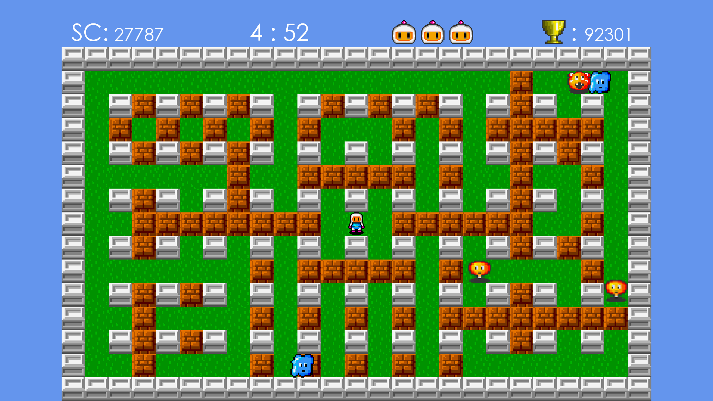

# Bombero

## Description
Bombero is a 2D game similar to Dyna Blaster (Bomberman). 
Goal of the game is eliminating all enemies and escaping through hidden gate. This is achieved by planting bombs. Player has limited amount of time to do that.

Game currently contains 8 playable levels with increasing difficulty. You can find 3 types of enemies in game:
- Potato
- Cloud
- Pig

Your progress is saved localy, so you can continue in the last level where you got. 
Your goal is to get the biggest score from all players. Highscore is then saved on a remote server.

### Controls
Screenshot: S
#### Menu
Next option: arrows down, right
Previous option: arrows down, right
Exit: escape
#### Game
Movement: arrows (up / down / left / right .. arrow)
Place bomb: space
Pause: P
Back to menu: escape

### Menu
After game starts, player can see a menu with following options:
- **Continue** - continue with last level (grayed if you did not complete the first level)
- **New game** - starts a new game with level #1. 
Player has 3 lives available. 
Explosion size: 1
Available boms: 1 
- **Select level** - opens list of available levels where player can select specific level or return to main menu screen. (grayed if you did not complete the first level)
- **Reset** - resets your completion progress (grayed if you did not complete the first level)
- **Exit** - shuts down game.

### Initialization of game
Loads assets. Fetches highscore from remote server.

### Initialization of level
1. Load level - using level loader
2. Place enemies

### Main game cycle
#### Repeat:
1. Read input
2. Update world
3. Resolve collisions
4. Check game over conditions
5. Render game

#### End game:
- **success**: continue to next level
- **fail**: substract 1 life, if lives >= 0 restart level, otherwise it is game over
After victory or game over

### Map
Map contains static and dynamic objects:
#### A) Static objects
**Wall block** 
- undestructible
- nobody can moves through them

**Brick block** 
- destructible
- some enemies can move through, player cannot
- can contain item, which is revealed after contact with explosion

**Item** 
- hidden in bricks
- power ups (bomb count, explosion size), gate

**Gate** 
- opened when there are no enemies
- enemies are spawned after contact with explosion
- entering when opened begins end of level

**Fire powerup** 
- increases size of explosion by 1

**Bomb powerup** 
- increases number of placable bombs at one moment by 1

**Bomb** 
- planted by player
- after some time it will explode and destroy enemies, player, brick blocks and items in range
- will also explode after contact with explosion
- enemies can not go through

**Explosion** 
- replaces bomb after 4 seconds
- makes fire in 4 directions
- destroys bricks, items, enemies and also player if they are in contact
- default size of fire is 1, but can be enlarged by powerup item
- fire is spreading until its size - it can be stopped with wall or brick block

#### B) Dynamic objects
**Player** 
- can move to 4 directions: up, down, left, right 
- can plant bombs (1 or more ATM)
- can collect items
- lose 1 life after contact with enemy or explosion

**Enemy** 
- movement depends on specific enemy type (multiple strategies)
- player receives points after elimination (amount depends on enemy type)       

### Level loading
Level data are stored in image files. 
Each pixel of image represents object on map or empty field. 
Every object has a specific color.
Map size is defined by image dimensions.

## Architecture
### Class diagram
Following diagram displays basic concept of game's structure. Diagram focuses on main parts of code. 

There are __7 colors__, which distinguish purpose (package) of class:

&nbsp; &nbsp; **1. red** - main class, which extends from libGdx Game class 

&nbsp; &nbsp; **2. orange** - logic classes

&nbsp; &nbsp; **3. blue** - entity classes

&nbsp; &nbsp; **4. golden** - screen classes 

&nbsp; &nbsp; **5. purple** - assets and data classes

&nbsp; &nbsp; **6. green** - helper classes

&nbsp; &nbsp; **7. gray** - libGDX classes

### Activity diagram
Displays cycle of the game.

### Design patterns
#### Singleton
- *Bombero, MenuScreen, GameScreen, Assets, DataManager*
- there is just one instance of these classes and it is desirable to have acess to them from other classes

#### Flyweight
- *Assets*
- Each texture is loaded just once

#### Factory
- *EnemyFactory*
- generates enemies

## Graphics
### Main menu
Selected option is bigger and more outlined.
Unavailable options are gray.

### Main menu - select level
Label of selected level is bigger and more outlined. 
Labels of unavailable levels are gray.

### Game
Contains HUD and gameboard. 

HUD shows user:
- actual score
- time left
- lives left
- highscore

### Sprites
#### Player

#### Wall block

#### Empty field

#### Brick block

#### Powerups

#### Gate

#### Bomb

#### Explosion

#### Enemy Potato

#### Enemy Cloud

#### Enemy Pig

## Testing
### Mechanics
- added score after enemy elimination
- substract 1 life after player collide with enemy
- substract 1 life after player collide with explosion
- taking powerup increases stats
- breaking brick block with bomb
- bomb explodes

### Player
- move up
- move down
- move left
- move right
- do not move
- plant bomb

### Collisions
- player with wall / brick
- player with bomb
- enemy with wall
- brick with explosion
- enemy with explosion
